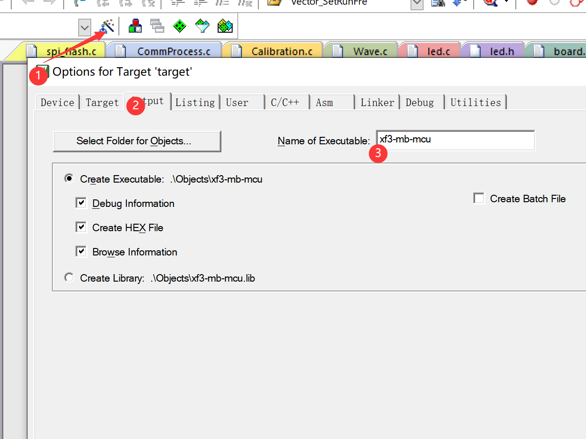

# 脚本编译说明
换源方式
```python
pip install -i https://pypi.tuna.tsinghua.edu.cn/simple 包名 #清华源
```

安装依赖
```python
pip install commentjson
pip install shutil
pip install re
```

打包成exe的工具
```python
# 安装工具包
pip install pyinstaller

#打包指令
pyinstaller -F -w --icon=chengzi.ico py_word.py

# -w表示屏蔽黑窗口, 如果需要使用到命令行(比如printf输出) 就不能加-w
# --icon=chengzi.ico, 表示指定图标
# py_word.py 表示需要打包为exe文件的python脚本
# --name=NAME 指定输出的exe文件的名称, 加不加.exe都一样
```
> 注意指令中的 = 号之间,不能随便添加空格


# 简介

### 使用keil自带的fromelf工具可以将axf文件格式化为bin文件.

该指令就是将 .axf 输出为一个和 .axf 文件同目录下的 .bin 文件

```shell
fromelf --bin -o "$L@L.bin" "#L"
```

指令的具体含义如下

```shell
// --bin = 转换为bin文件
// -o = 制定输出路径
// $P = .uvprojx文件所在路径 //如果有$L就是指.axf文件所在的路径
// @L = keil中 target/Output/Name of Executable 中设置的字符
// #L = keil中 target/Output/Name of Executable 中设置的字符 + .axf 这个文件   
```

.axf文件和 .bin文件的名称在下图所示位置设置



### 该脚本功能

可将指定目录中的 bin hex axf文件添加上版本信息拷贝到指定的输出路径.

`config.json` 配置文件内容如下

所有路径使用相对路径

```json
//只能使用相对路径
//相对路径是output.exe所在路径的相对路径
{
    "keilOutputDir": "../MDK-ARM/Objects", //keil编译输出路径, 从中提取axf文件和.hex文件

    "versionFile": "./version.h", //版本文件
    "versionStr": "#define SOFT_VERSION" , //版本文件中的版本号字符串
  
    "outputDir": "./", //输出路径
  
    "removeHistory": true, //是否删除历史版本
  
    "versionEnable": true, //是否启用版本文件, 不启用示例 filename.bin, 启用示例: filename-version.bin
    "binEnable": true,  //是否拷贝bin文件
    "hexEnable": false,   //是否拷贝hex文件
    "axfEnable": false   //是否拷贝axf文件

}
```
